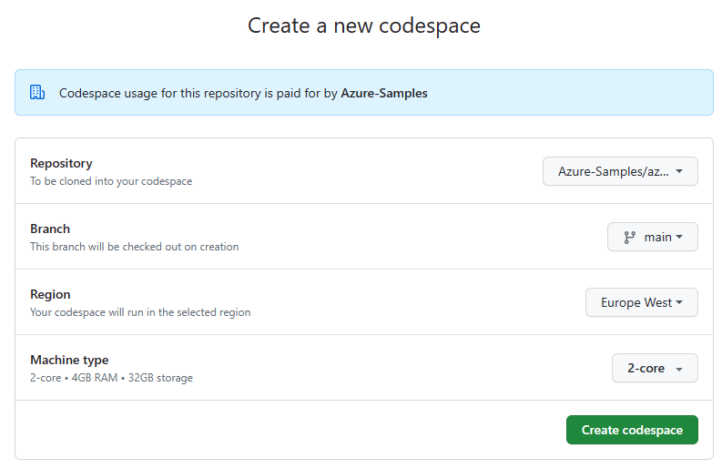

# Project Name

This sample application deploys an AI-powered document search using Azure OpenAI Service, Azure Kubernetes Service (AKS), and a Python application leveraging the [Llama index](https://gpt-index.readthedocs.io/en/latest/). The application will be deployed within a virtual network to ensure security and isolation. Users will be able to upload documents and ask questions based on the content of the uploaded documents.

## Features

This project framework provides the following features:

* TODO
* 
* ...

## Getting Started

### Prerequisites

- Azure Subscription.
- Subscription access to Azure OpenAI service. Request Access to Azure OpenAI Service [here](https://customervoice.microsoft.com/Pages/ResponsePage.aspx?id=v4j5cvGGr0GRqy180BHbR7en2Ais5pxKtso_Pz4b1_xUOFA5Qk1UWDRBMjg0WFhPMkIzTzhKQ1dWNyQlQCN0PWcu).
- Terraform.

### Quickstart

#### From Codespace

- Run the following command to create a service principal with the "Owner" role for a specific subscription, and outputs its information in JSON format.

    ```bash
    az ad sp create-for-rbac --role="Owner" --scopes="/subscriptions/<SUBSCRIPTION_ID>" -o json
    ```

- In your github account go to Codespaces and Create a new Codespace with "Azure-Sample/azure-openai-terraform-deployment-sample" repository and select the main branch.

    

- In your github account, go to Settings. On the left pane, select Codespaces tab and create a secret for ARM_CLIENT_ID, ARM_CLIENT_ID, ARM_SUBSCRIPTION_ID and ARM_TENANT_ID values, as shown in the image bellow. For each secret, on the Repository access section, click on the "Select repositories" dropdown menu and select "Azure-Sample/azure-openai-terraform-deployment-sample".

    

- Open your codespace.

- Using the codespace terminal, go to infra folder and run the following command to initialize your working directory.

    ```bash
    terraform init
    ```

-  Run terraform apply to deploy all the necessary resources on Azure.

    ```bash
    terraform apply
    ```

- Run the following command. This script retrieves the AKS cluster credentials, logs in to the ACR, builds and pushes a Docker image, creates a federated identity, and deploys resources to the Kubernetes cluster using a YAML manifest.

    ```bash
    terraform output -raw installation-script | bash
    ```

- Get the external ip address of the service by running the  command bellow.

    ```bash
    kubectl get services -n chatbot
    ```

- Copy the external ip address and paste it in your browser. The application should load in a few seconds.

#### From your machine

- Clone or fork this repository.
- Go to infra and run the following command to initialize your working directory.

    ```bash
    terraform init
    ```

-  Run terraform apply to deploy all the necessary resources on Azure.

    ```bash
    terraform apply
    ```

- Run the following command. This script retrieves the AKS cluster credentials, logs in to the ACR, builds and pushes a Docker image, creates a federated identity, and deploys resources to the Kubernetes cluster using a YAML manifest.

    ```bash
    terraform output -raw installation-script | bash
    ```

- Get the external ip address of the service by running the  command bellow.

    ```bash
    kubectl get services -n chatbot
    ```

- Copy the external ip address and paste it in your browser. The application should load in a few seconds.


## Resources

- [Azure OpenAI](https://learn.microsoft.com/en-us/azure/cognitive-services/openai/overview)
- 
- ...
